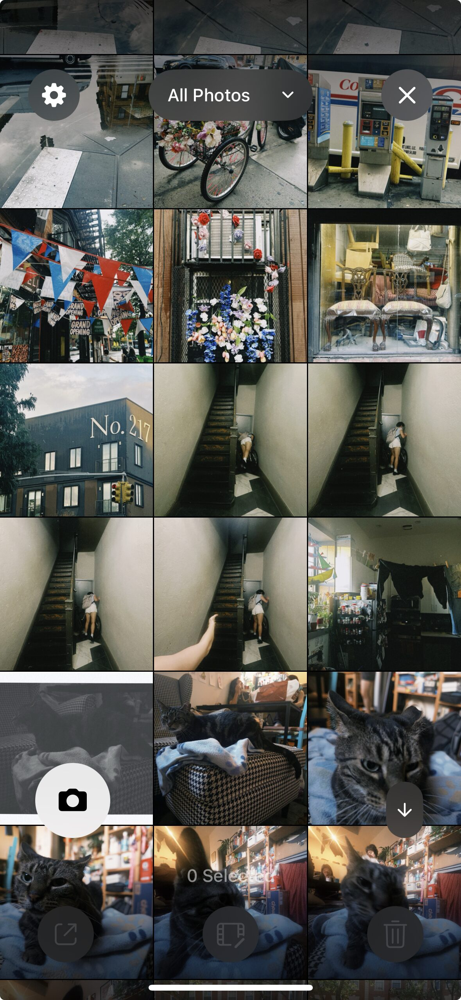
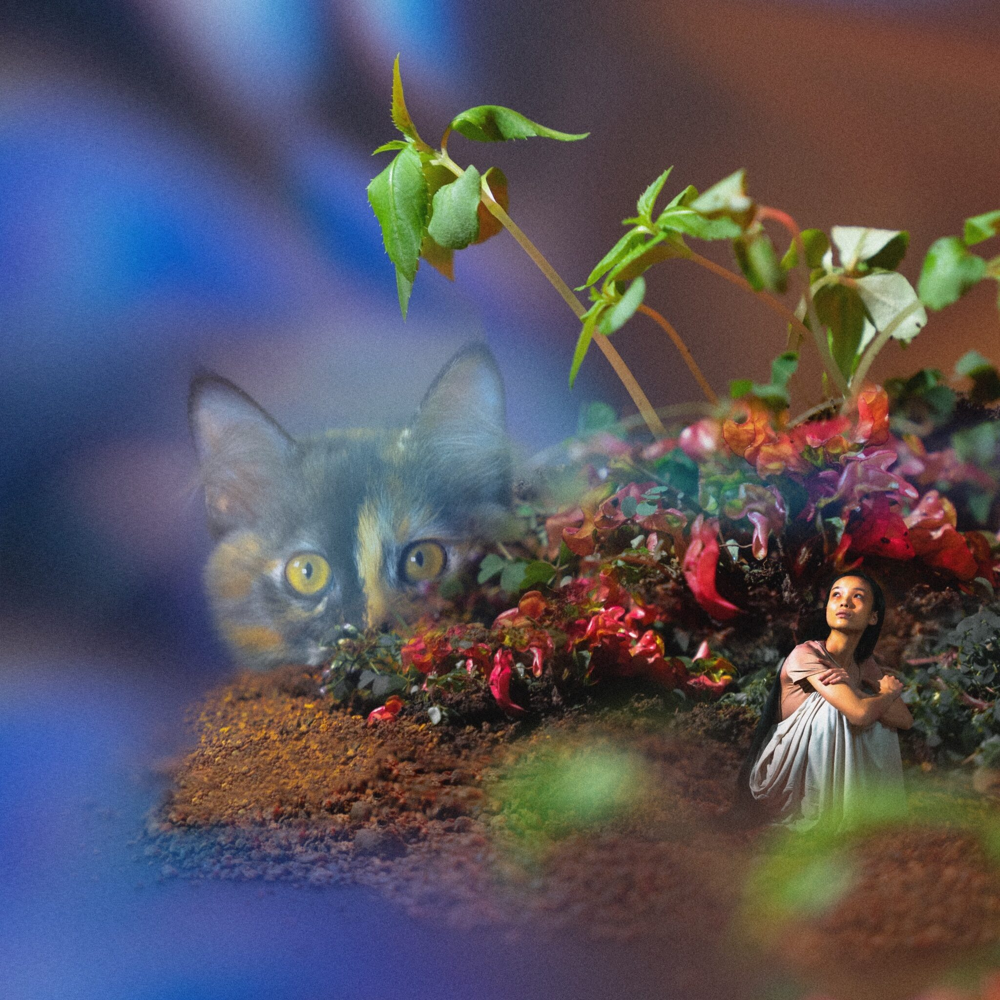
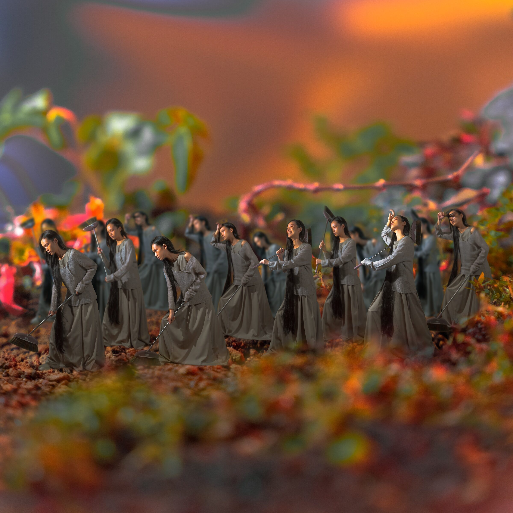

# Local & Global
### Elizabeth Kezia Widjaja | @ekezia

## Local/Global from a Geographical Context 🌎

| Indonesia 🇮🇩 | Hong Kong 🇭🇰 | HK x SG 🇸🇬 x HK |
| --- | --- | --- |
| **Chindo:** am I local enough? | **🎓 School of Creative Media, City University of Hong Kong** | **💼 Employment → Frontend developer** |
| Adaptation skills 🦋 | New media + interdisciplinary practice | Modularity |
| - | Photography: photographing individual objects with little conceptual intervention | `` |

## Local/Global from Structural Thinking 🪜

### Bottom-Up ⬇⬆
Photograph object ➡ establish connections between them afterwards.
 
</img>
 
###  Top-Down ⬆⬇
Create rules / system ➡ Explore how different objects populate and transform the system.

