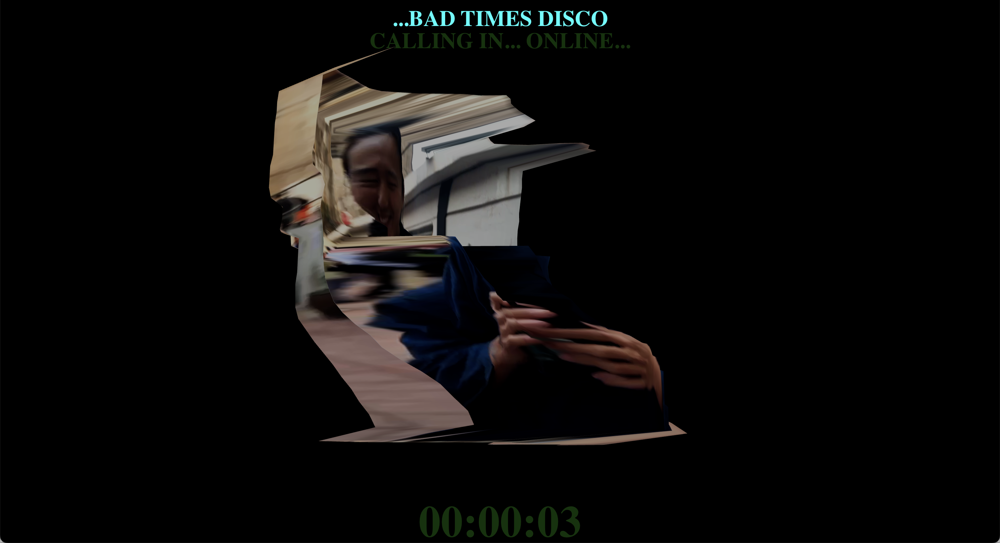
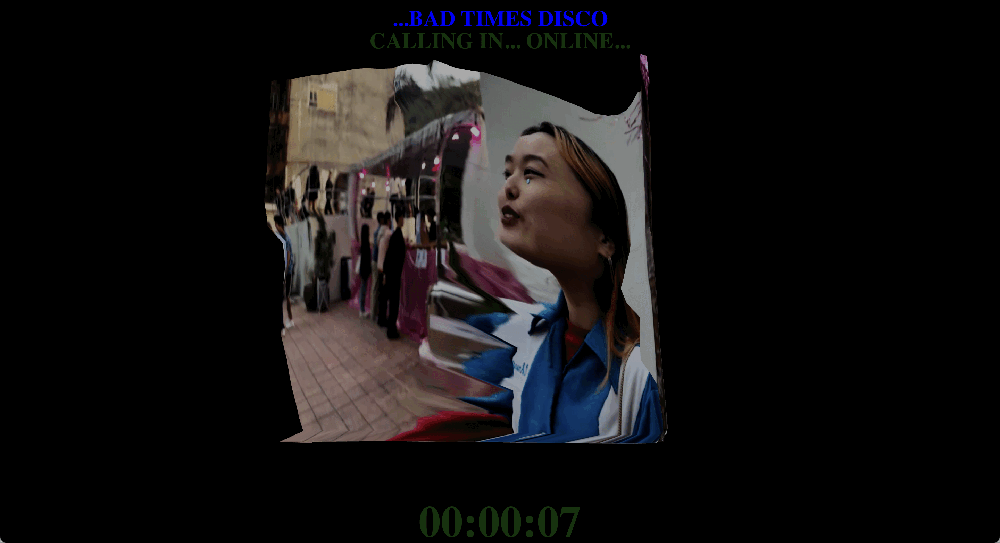
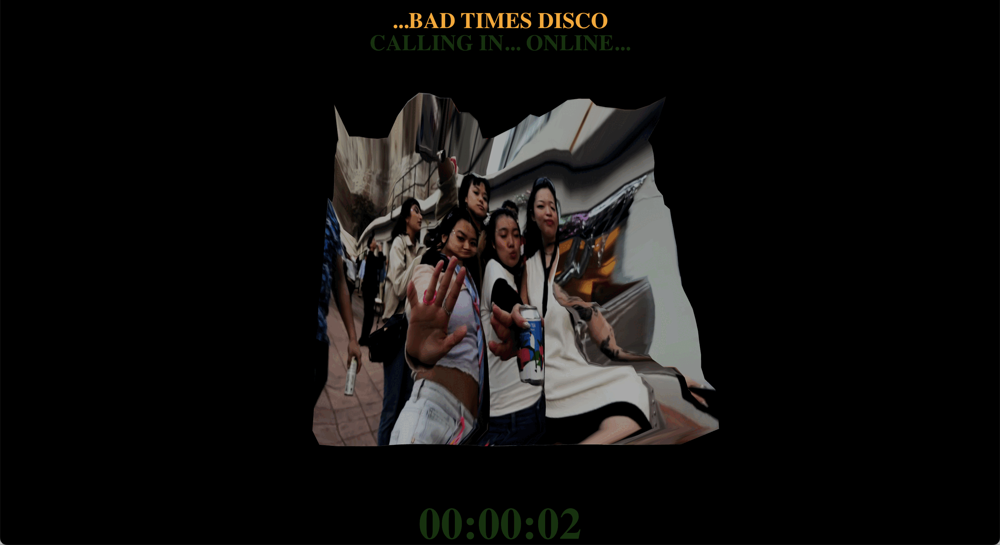
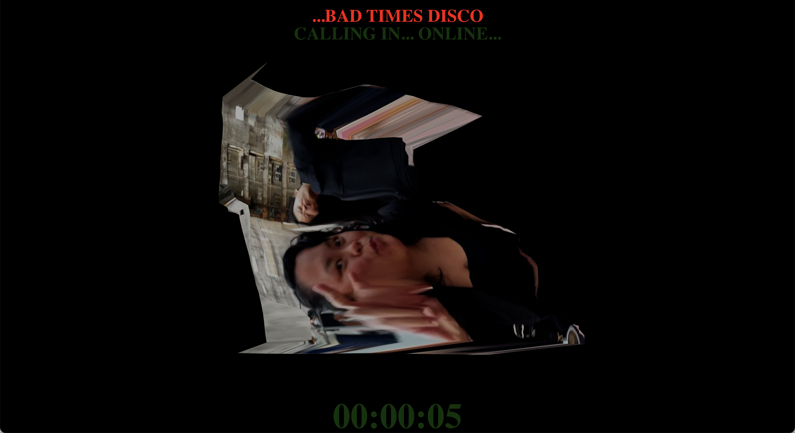
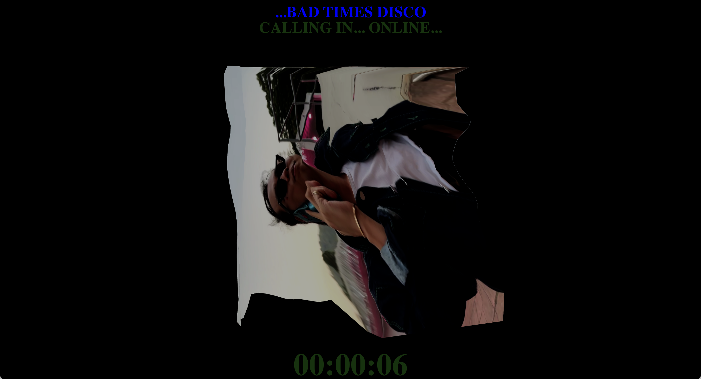
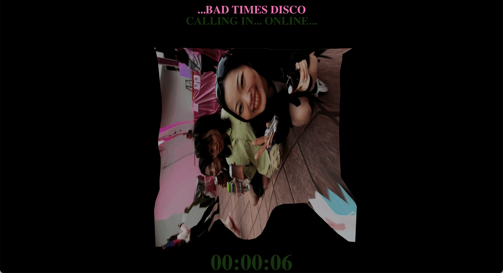

# CASE02: Real-Time Photogrammetry
### Call Me Party at Bad Times Disco
  - Personal Goal: Photography as **alternative documentation process** -> durational program that can be adapted to different events
  - The starting point of my creative-coding experimentation with photography.

<div style="display: flex; gap: 8px; align-items: flex-start;">
  
  
  
</div>
<div style="display: flex; gap: 8px; align-items: flex-start;">
  
  
  
</div>


## The Question

> How can I photograph or document the same event in a different way?

Build a **real-time system** that:
  - Captures a two-dimensional image.
  - Converts it into a three-dimensional photogrammetry-like object.
  - Immediately projects the generasted object into the event space.

## The System

| Component | Role |
| --- | --- |
| iPhone camera feed | Captures people at the current moment |
| Python script | Coordinates the image-conversion process |
| MiDaS model | Estimates depth from the 2D image from a single image |
| Blender | Generates and displays the 3D object |
| NodeJS | Sends 3D object to database |
| ReactJS | Displays 3D objects with ThreeJS |
| Projector | Returns the transformed image to the live event |

## Breaking It Down
| Programming Concept | Artistic Concept |
| --- | --- |
| Function | The logic to estimate depth from 2D image and conver it into 3D object |
| Arguments | 2D image |
| Result | 3D image-textured objects |

```python
def document_event(camera_capture):
    depth = midas.estimate_depth(camera_capture)
    object_3d = blender.create_object(camera_capture, depth)
    projector.display(object_3d)
```

## The Audience Becomes the Work

- Documentation was no longer only a record of the event:
  - It became live.
  - It became participatory.
  - It transformed the people and atmosphere it documented.
