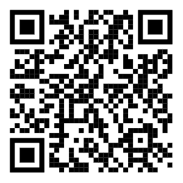

# YOUR TURN!!!

## The Question
> Does an Artist have an underlying algorithm in their work that meaningfully informs their theme, style and working process?
Across different works, an artist often repeats:
  - A distinct habit.
  - A process or formula.
  - A way of organizing materials.
  - A logic that can be iterated and transformed.
- Different materials enter the process and produce different artworks.

```js
function artisticPractice(materials) {
  return repeatedLogic(materials);
}
```

> what has been the **arguments** and the **function / logic** that you like to use in your own practice? 

These can also be conscious frameworks or habits that have gradually shaped who you are and how you work today.

```js
function you(your_input_here) {
    your_logic_here;
}
```

This presentation is available here:
<br />
  
